## Simulacion red

### Simulación básica

### Análisis de transitorios

### Resimulación de un trial particular

## Simulación con distintos valores de Iapp

### Iapp = 2.0

    trial 3 estado inicial: [-70, np.float64(0.08891092383602917), np.float64(0.0801241891785539), -65, np.float64(0.8191959946495607), np.float64(0.8452238688130184)]
    duración (segundos) de la simulación 34.41588234901428
    

    
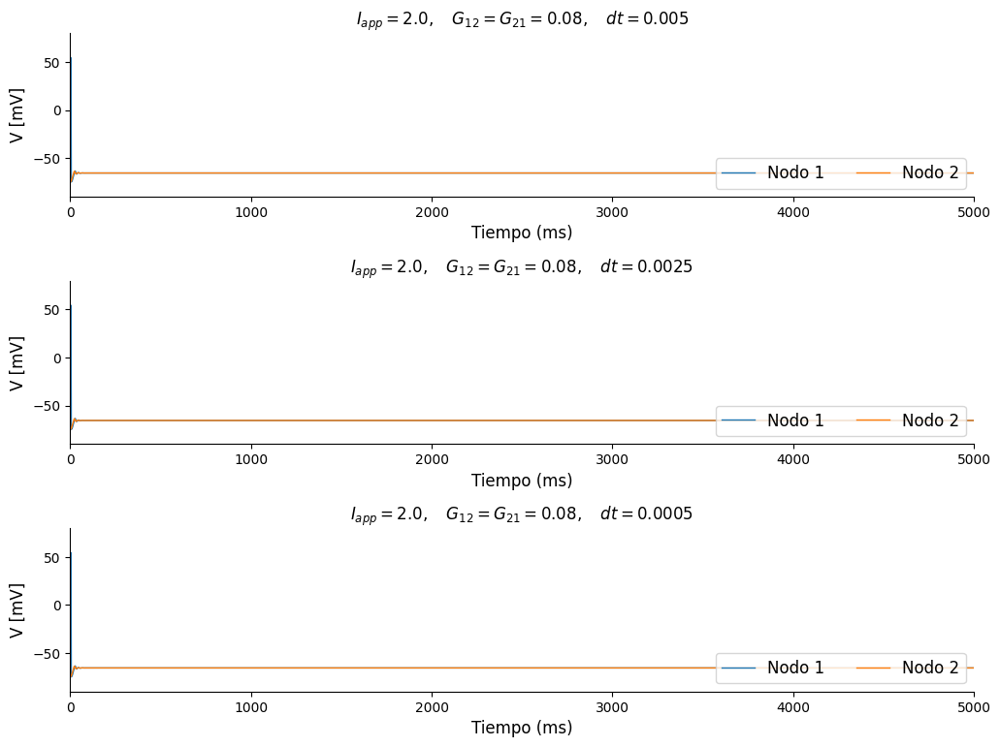
    

### Iapp = 2.1

    trial 3 estado inicial: [-70, np.float64(0.29372639335997375), np.float64(0.7406893925523093), -65, np.float64(0.5942586895203702), np.float64(0.6614604999694791)]
    duración (segundos) de la simulación 34.632018089294434
    

    
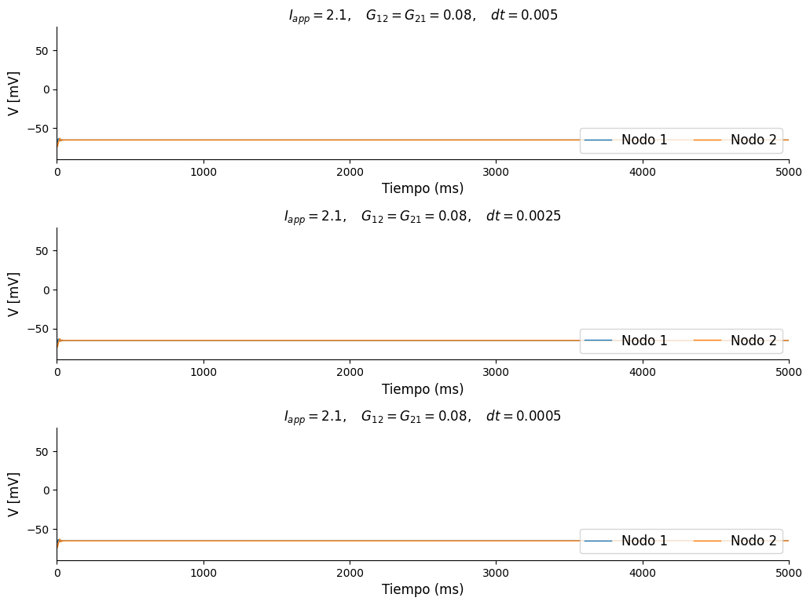
    

### Iapp = 2.2

    trial 3 estado inicial: [-70, np.float64(0.9231316107212821), np.float64(0.1940296925670808), -65, np.float64(0.6164205508082117), np.float64(0.7944864992149334)]
    duración (segundos) de la simulación 38.34648823738098
    

    
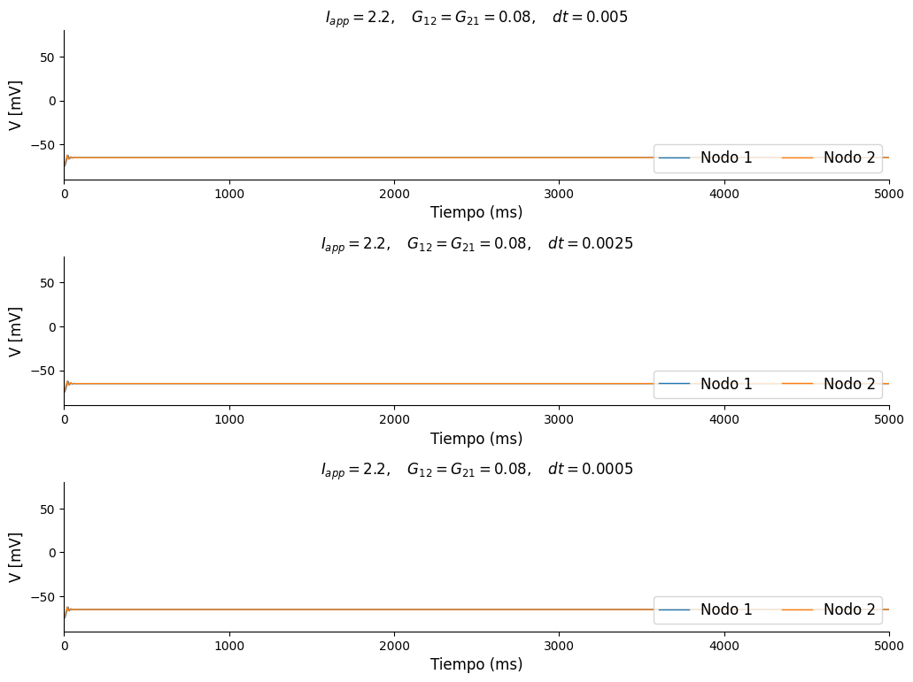
    

### Iapp = 2.3

    trial 3 estado inicial: [-70, np.float64(0.3972533083228137), np.float64(0.8719495023806689), -65, np.float64(0.573808084472319), np.float64(0.46549410349590714)]
    duración (segundos) de la simulación 35.76494574546814
    

    

    

### Iapp = 2.4

    trial 3 estado inicial: [-70, np.float64(0.5656901081376878), np.float64(0.25153320387617395), -65, np.float64(0.6619769409403116), np.float64(0.6374861356539657)]
    duración (segundos) de la simulación 50.54476523399353
    corte por umbral!
    corte por umbral!
    corte por umbral!
    

    
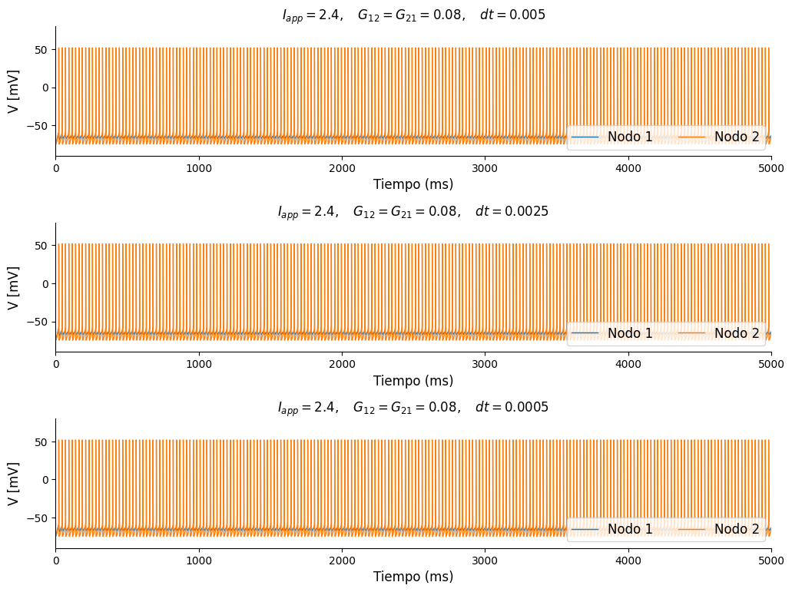
    

### Iapp=2.5

    trial 3 estado inicial: [-70, np.float64(0.22092638395084663), np.float64(0.7384184703924418), -65, np.float64(0.0023252669241486945), np.float64(0.8247685794089109)]
    duración (segundos) de la simulación 34.41529870033264
    corte por umbral!
    corte por umbral!
    corte por umbral!
    

    
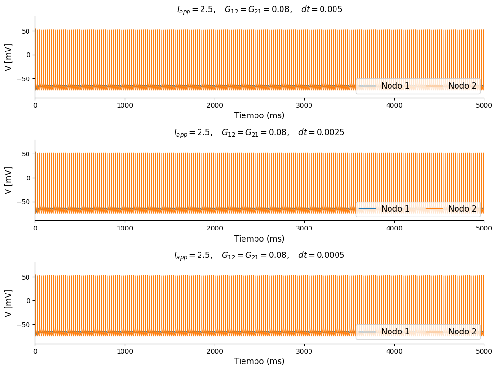
    

### Iapp= 2.6

    trial 3 estado inicial: [-70, np.float64(0.3909635843590943), np.float64(0.9229770347530383), -65, np.float64(0.3888187181857705), np.float64(0.6679693705229727)]
    duración (segundos) de la simulación 35.184600591659546
    corte por umbral!
    corte por umbral!
    corte por umbral!
    

    
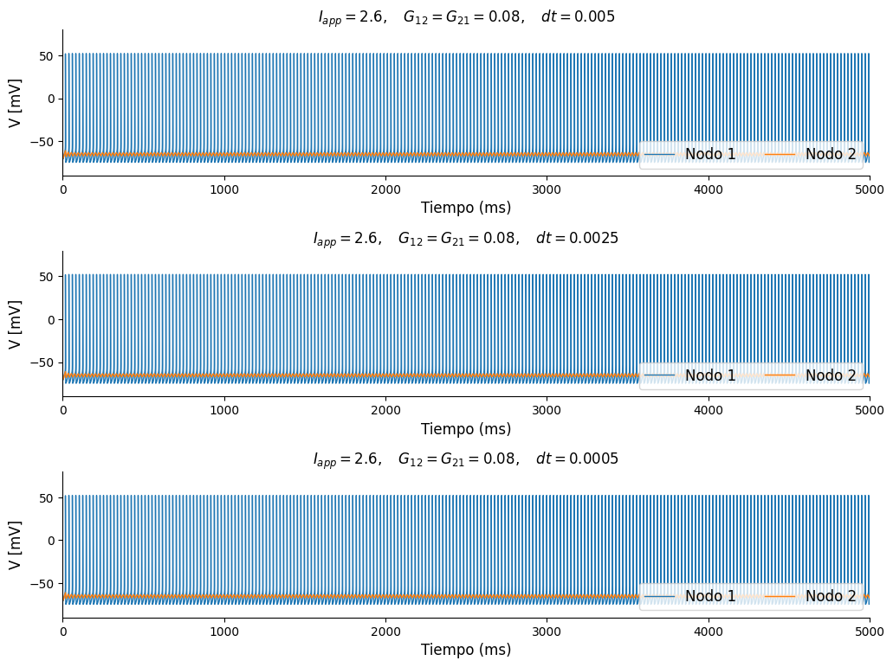
    

### Iapp=2.7

    trial 3 estado inicial: [-70, np.float64(0.8518926729618609), np.float64(0.7715381020773638), -65, np.float64(0.10156472373005165), np.float64(0.6837931406734558)]
    duración (segundos) de la simulación 33.51022696495056
    corte por umbral!
    corte por umbral!
    corte por umbral!
    

    
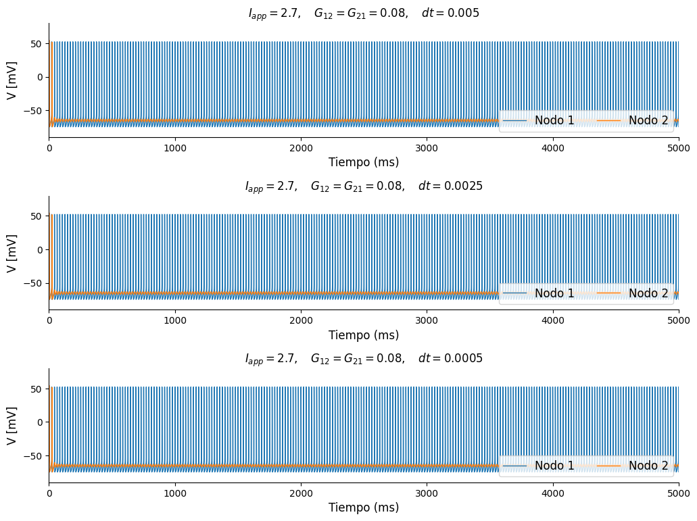
    

### Iapp = 2.75

    trial 3 estado inicial: [-70, np.float64(0.10618856653078801), np.float64(0.8837907672736909), -65, np.float64(0.7581136639215974), np.float64(0.7222576812021636)]
    duración (segundos) de la simulación 88.59154081344604
    corte por umbral!
    corte por umbral!
    corte por umbral!
    

    
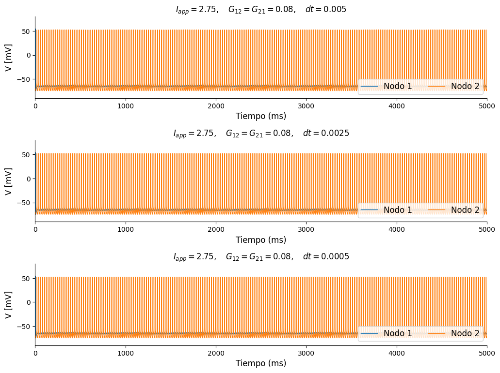
    

### Iapp = 2.8

    trial 3 estado inicial: [-70, np.float64(0.5641848324321168), np.float64(0.20670885443629616), -65, np.float64(0.3137132774688033), np.float64(0.06942905964681079)]
    duración (segundos) de la simulación 34.24997901916504
    corte por umbral!
    corte por umbral!
    corte por umbral!
    

    
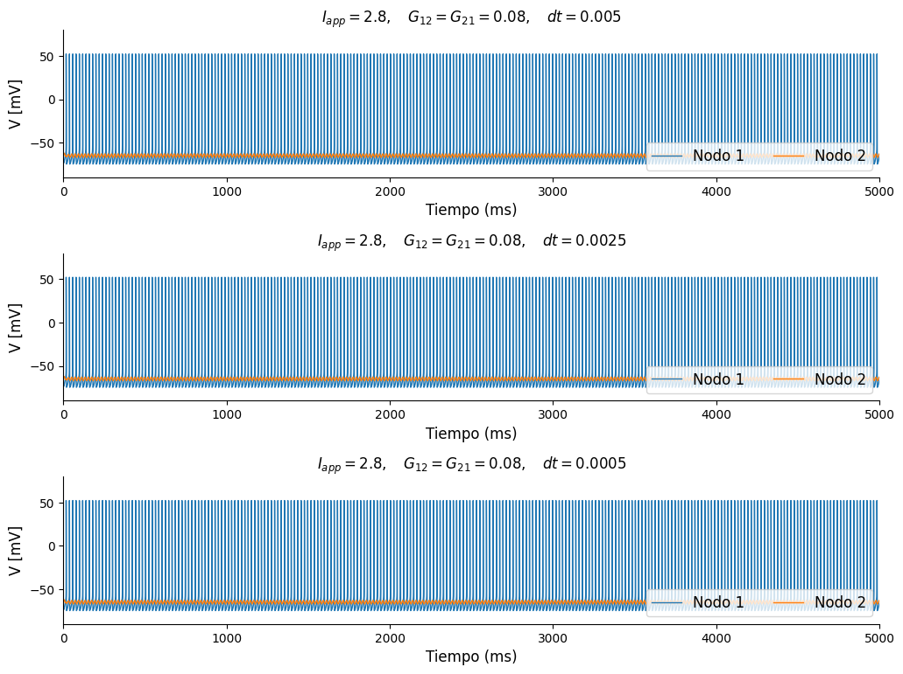
    

### Iapp = 2.9

    trial 3 estado inicial: [-70, np.float64(0.3666500091812549), np.float64(0.6167452275200734), -65, np.float64(0.15857540269421), np.float64(0.05904757088467949)]
    duración (segundos) de la simulación 36.086928844451904
    corte por umbral!
    corte por umbral!
    corte por umbral!
    

    
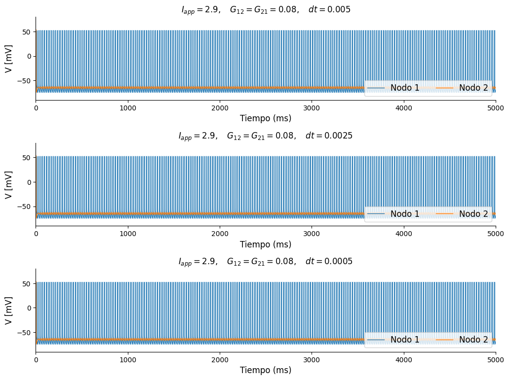
    

### Iapp = 3

    trial 3 estado inicial: [-70, np.float64(0.7204051814800847), np.float64(0.12858608245456016), -65, np.float64(0.8776222386461795), np.float64(0.7540833412326756)]
    duración (segundos) de la simulación 34.441142082214355
    corte por umbral!
    corte por umbral!
    corte por umbral!
    corte por umbral!
    corte por umbral!
    corte por umbral!
    

    
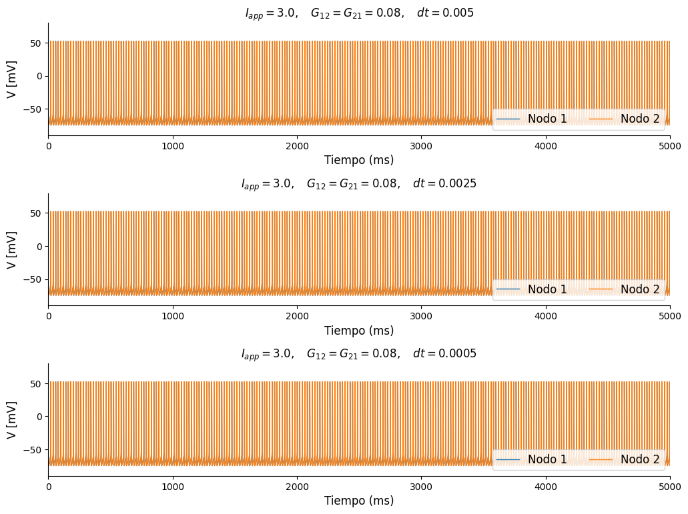
    

### Iapp = 3.1

    trial 3 estado inicial: [-70, np.float64(0.289796040642582), np.float64(0.25930388328225107), -65, np.float64(0.6170482885310147), np.float64(0.8500983918095836)]
    duración (segundos) de la simulación 55.40430665016174
    corte por umbral!
    corte por umbral!
    corte por umbral!
    corte por umbral!
    corte por umbral!
    corte por umbral!
    

    
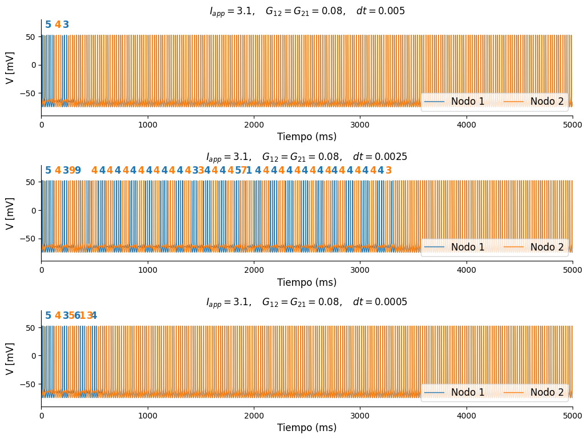
    

### Iapp = 3.2

    trial 3 estado inicial: [-70, np.float64(0.6919160494903807), np.float64(0.9453394258229556), -65, np.float64(0.319514306359433), np.float64(0.791565021683369)]
    duración (segundos) de la simulación 34.03667974472046
    corte por umbral!
    corte por umbral!
    corte por umbral!
    corte por umbral!
    

    
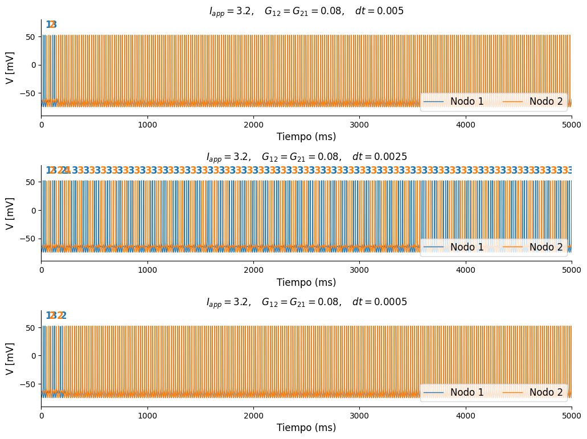
    

### Iapp = 3.3

    trial 3 estado inicial: [-70, np.float64(0.19627658331285358), np.float64(0.684331951708082), -65, np.float64(0.4936234515631792), np.float64(0.97215188128835)]
    duración (segundos) de la simulación 31.65702486038208
    corte por umbral!
    corte por umbral!
    corte por umbral!
    corte por umbral!
    corte por umbral!
    corte por umbral!
    

    
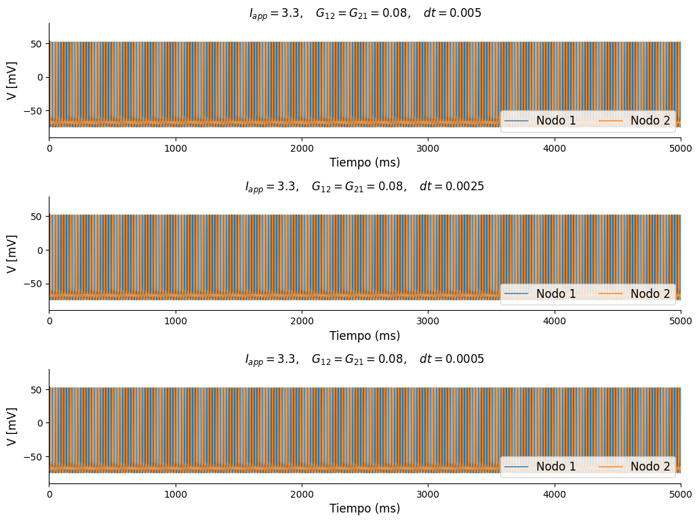
    

### Iapp = 3.4

    trial 3 estado inicial: [-70, np.float64(0.11074190930607908), np.float64(0.5089264724274882), -65, np.float64(0.6215988256857418), np.float64(0.4722128015529963)]
    duración (segundos) de la simulación 31.358159065246582
    

    
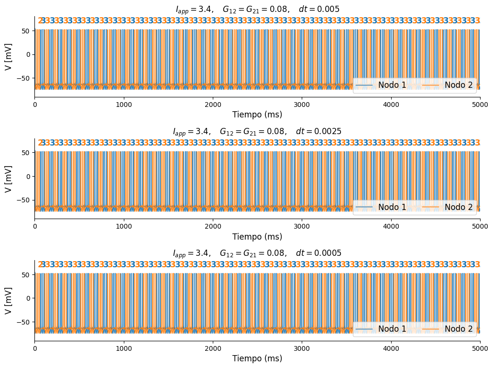
    

### Iapp = 3.5

    trial 3 estado inicial: [-70, np.float64(0.3859170534584907), np.float64(0.6337939505544279), -65, np.float64(0.3074002708970254), np.float64(0.3101182570955161)]
    duración (segundos) de la simulación 46.99792742729187
    corte por umbral!
    corte por umbral!
    corte por umbral!
    corte por umbral!
    corte por umbral!
    corte por umbral!
    

    
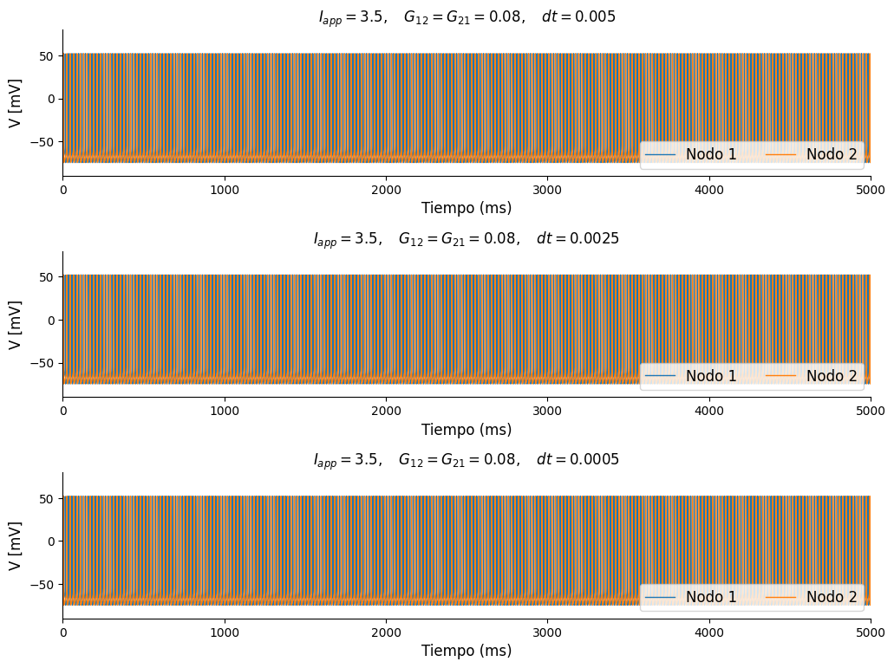
    

### Iapp = 3.6

    trial 3 estado inicial: [-70, np.float64(0.9737583104066414), np.float64(0.6489949838559274), -65, np.float64(0.16933517395241648), np.float64(0.5074504661589458)]
    duración (segundos) de la simulación 36.29109048843384
    corte por umbral!
    corte por umbral!
    corte por umbral!
    corte por umbral!
    corte por umbral!
    corte por umbral!
    

    

    

### Iapp = 3.7

    trial 3 estado inicial: [-70, np.float64(0.23471079078215729), np.float64(0.9867623122013071), -65, np.float64(0.9835759300091333), np.float64(0.36693594059190027)]
    duración (segundos) de la simulación 32.26009941101074
    corte por umbral!
    corte por umbral!
    corte por umbral!
    corte por umbral!
    corte por umbral!
    corte por umbral!
    

    
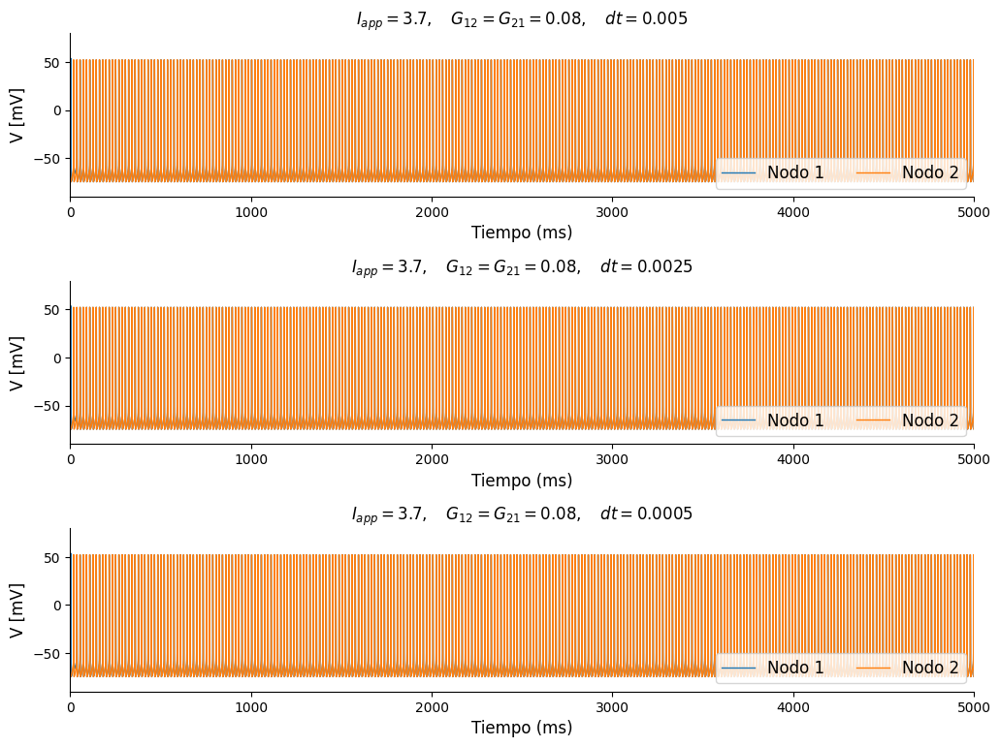
    

### Iapp = 3.8

    trial 3 estado inicial: [-70, np.float64(0.9448172061486962), np.float64(0.4914837468783323), -65, np.float64(0.0698904375163446), np.float64(0.7571659454714478)]
    duración (segundos) de la simulación 36.104575634002686
    corte por umbral!
    corte por umbral!
    corte por umbral!
    corte por umbral!
    corte por umbral!
    corte por umbral!
    

    
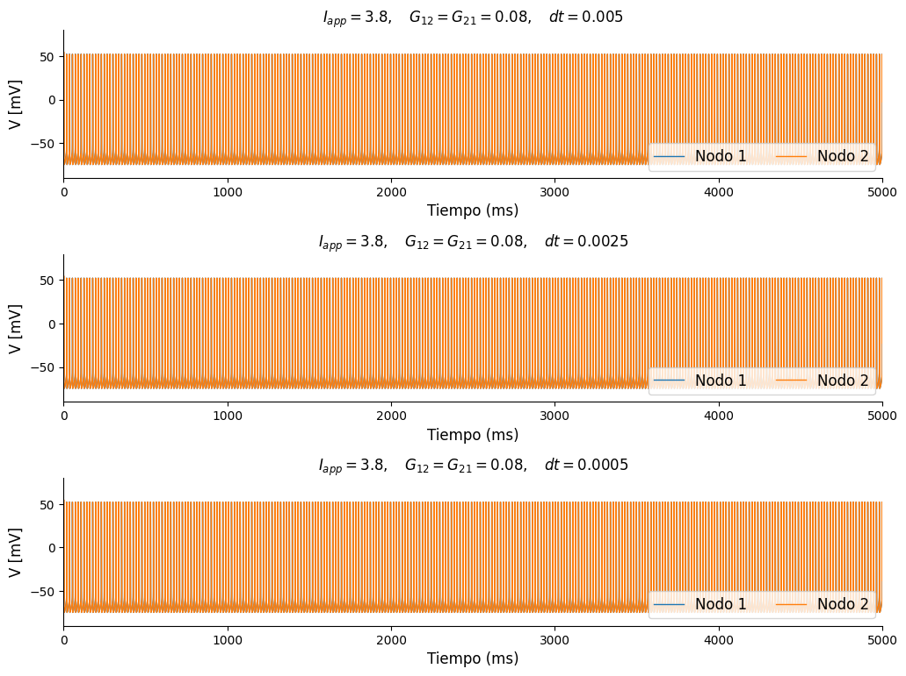
    

### Iapp = 3.9

    trial 3 estado inicial: [-70, np.float64(0.6166513688479962), np.float64(0.8936840486538589), -65, np.float64(0.8940135848146048), np.float64(0.3034821832579385)]
    duración (segundos) de la simulación 32.32422614097595
    

    
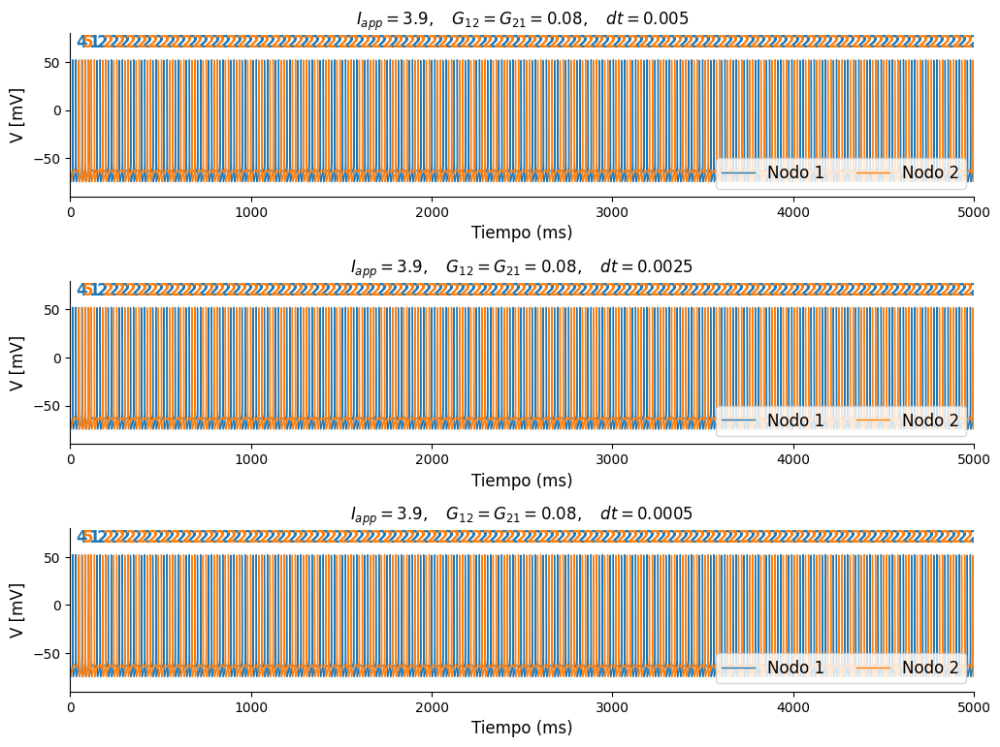
    

### Iapp = 4

    trial 3 estado inicial: [-70, np.float64(0.7210176230687065), np.float64(0.6717434470294442), -65, np.float64(0.6062828025876453), np.float64(0.40600991553062415)]
    duración (segundos) de la simulación 53.11303758621216
    corte por umbral!
    

    
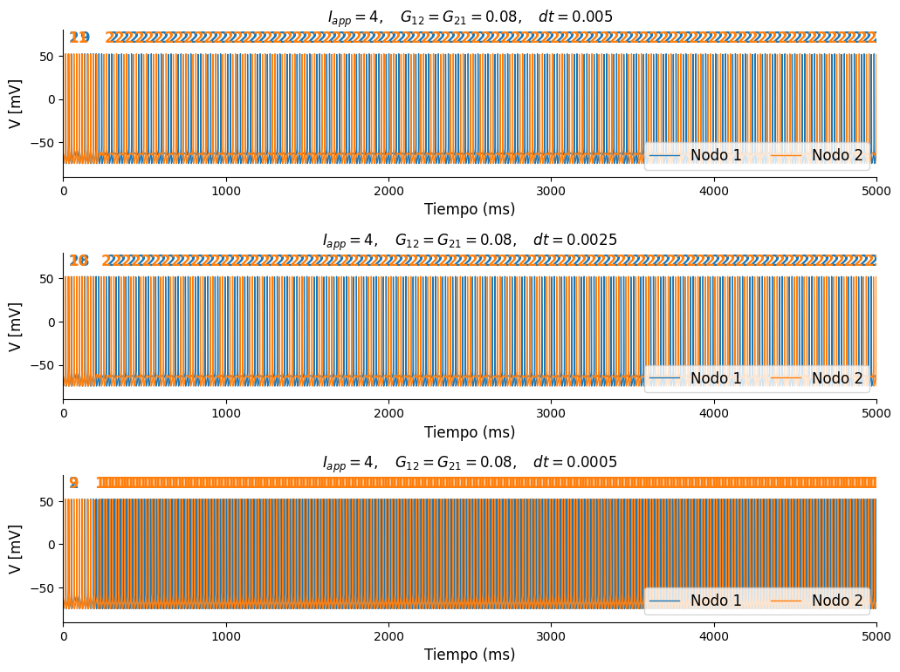
    

# Varío valores de G12,G21

## Vario G21, con Iapp = 2.6

    trial 3 estado inicial: [-70, np.float64(0.7704223274965388), np.float64(0.062168238382753205), -65, np.float64(0.642455736173446), np.float64(0.7673008634321297)]
    duración (segundos) de la simulación 70.66915655136108
    corte por umbral!
    corte por umbral!
    corte por umbral!
    

    
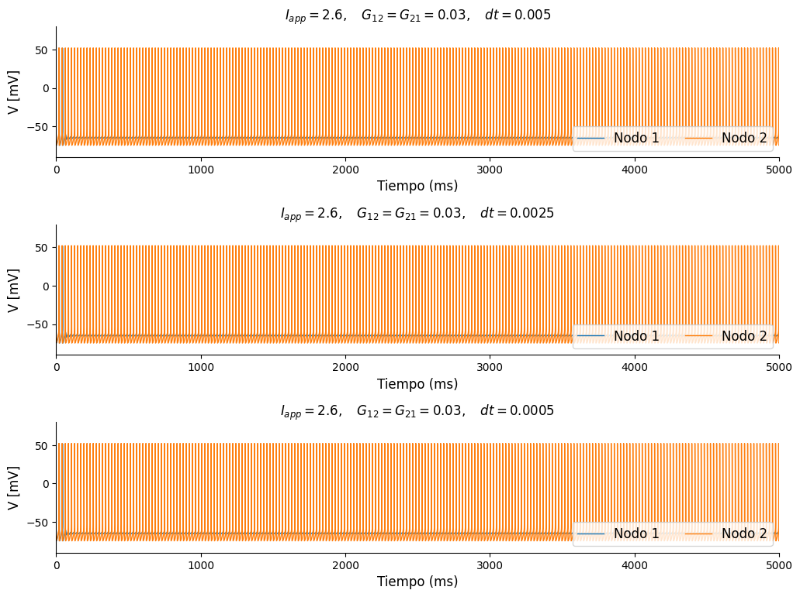
    

    trial 3 estado inicial: [-70, np.float64(0.6947642766324098), np.float64(0.6225578173377279), -65, np.float64(0.35929122684966475), np.float64(0.7510648628917711)]
    duración (segundos) de la simulación 56.878416299819946
    corte por umbral!
    corte por umbral!
    corte por umbral!
    

    
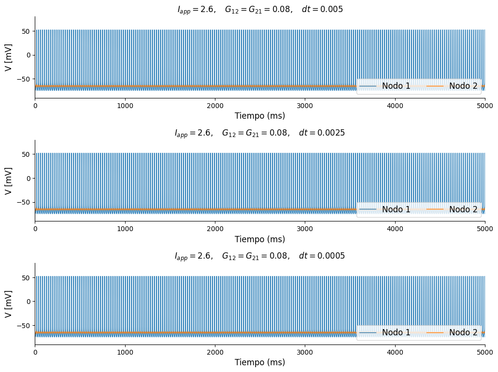
    

    trial 3 estado inicial: [-70, np.float64(0.37451626182752984), np.float64(0.42763831544336695), -65, np.float64(0.5681056173951979), np.float64(0.23415099492266633)]
    duración (segundos) de la simulación 49.09554362297058
    corte por umbral!
    corte por umbral!
    corte por umbral!
    

    
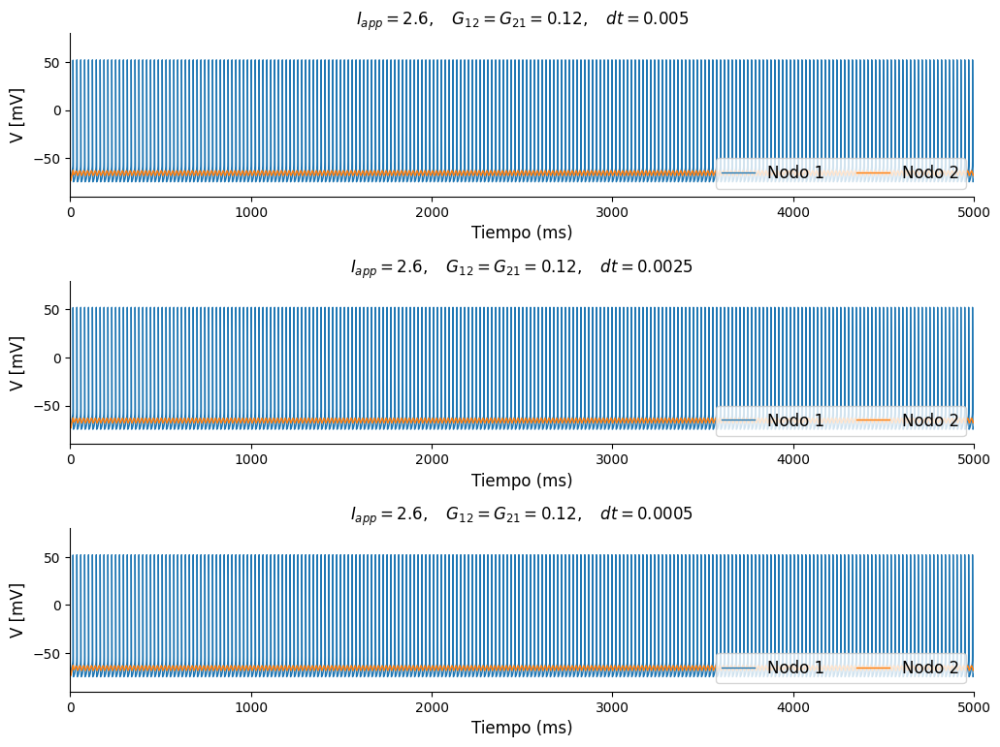
    

    trial 3 estado inicial: [-70, np.float64(0.814542356011403), np.float64(0.359406358751705), -65, np.float64(0.8546576662319528), np.float64(0.5520506185995072)]
    duración (segundos) de la simulación 68.12777328491211
    corte por umbral!
    corte por umbral!
    corte por umbral!
    corte por umbral!
    corte por umbral!
    corte por umbral!
    

    
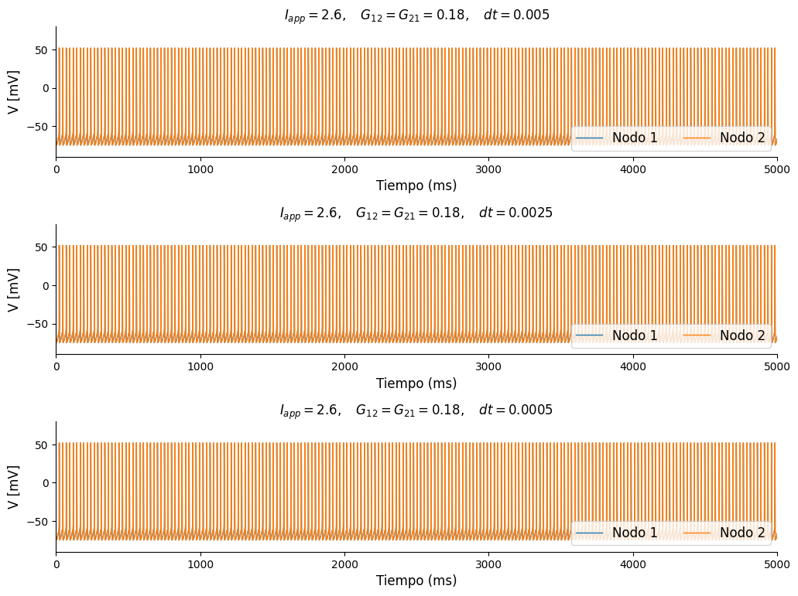
    

    trial 3 estado inicial: [-70, np.float64(0.7879954598583336), np.float64(0.7285998862097369), -65, np.float64(0.5483662116325257), np.float64(0.30060488936927143)]
    duración (segundos) de la simulación 52.591495990753174
    corte por umbral!
    corte por umbral!
    corte por umbral!
    corte por umbral!
    corte por umbral!
    corte por umbral!
    

    
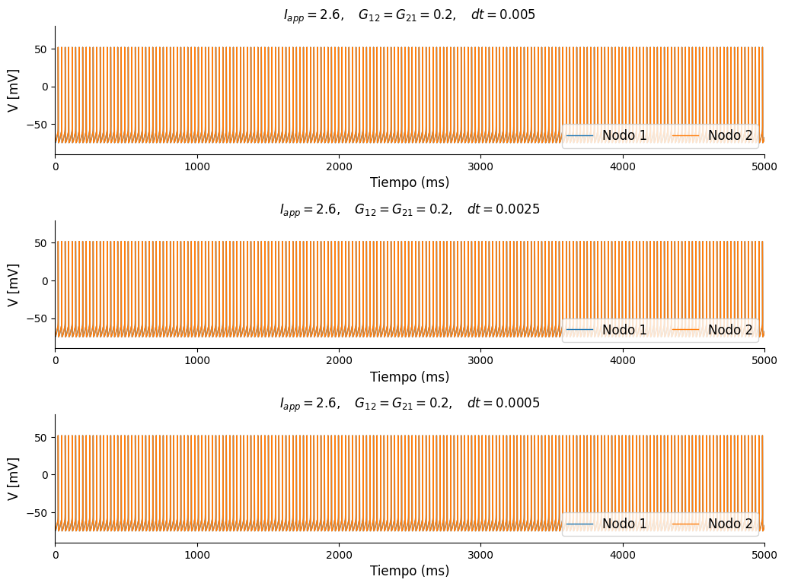
    

## Vario G21 con Iapp = 3.1

    trial 3 estado inicial: [-70, np.float64(0.3679938919180734), np.float64(0.10893208472453753), -65, np.float64(0.6516660205022479), np.float64(0.3287261834882993)]
    duración (segundos) de la simulación 95.17715716362
    corte por umbral!
    corte por umbral!
    corte por umbral!
    corte por umbral!
    corte por umbral!
    corte por umbral!
    

    
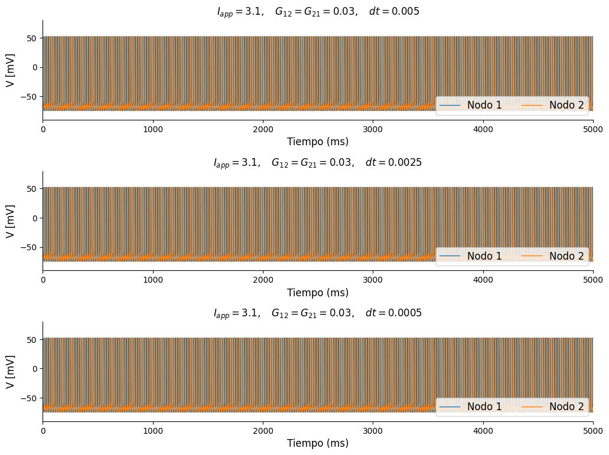
    

    trial 3 estado inicial: [-70, np.float64(0.9267258269967479), np.float64(0.1927815368034812), -65, np.float64(0.4211374107411062), np.float64(0.6934004616331578)]
    duración (segundos) de la simulación 66.09658527374268
    corte por umbral!
    corte por umbral!
    corte por umbral!
    corte por umbral!
    corte por umbral!
    corte por umbral!
    

    
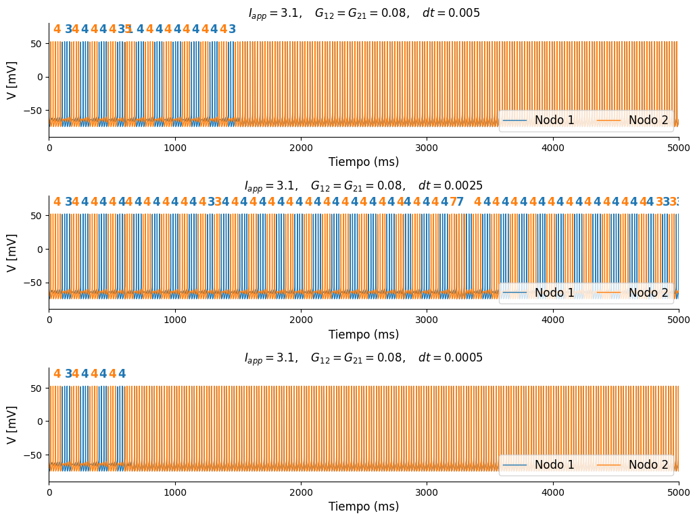
    

    trial 3 estado inicial: [-70, np.float64(0.7609469359586711), np.float64(0.97872763967421), -65, np.float64(0.23052615392490616), np.float64(0.2663573848567077)]
    duración (segundos) de la simulación 52.60902214050293
    

    
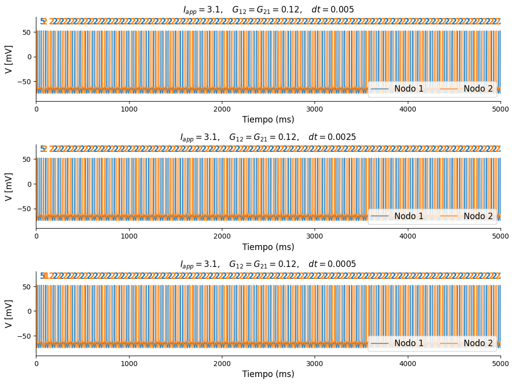
    

    trial 3 estado inicial: [-70, np.float64(0.4532076706823378), np.float64(0.27812337848660174), -65, np.float64(0.33000023525755096), np.float64(0.3428987832103133)]
    duración (segundos) de la simulación 52.191811084747314
    corte por umbral!
    corte por umbral!
    corte por umbral!
    corte por umbral!
    corte por umbral!
    corte por umbral!
    

    
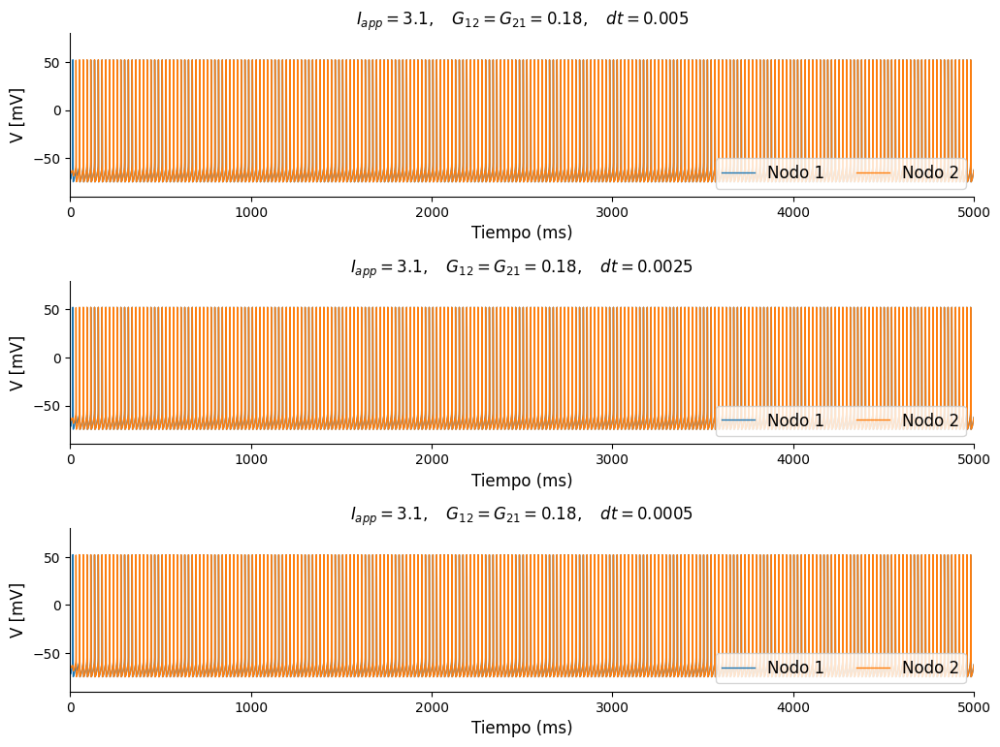
    

    trial 3 estado inicial: [-70, np.float64(0.31146182807590905), np.float64(0.6697824665662236), -65, np.float64(0.4161251135216214), np.float64(0.7066480134145106)]
    duración (segundos) de la simulación 49.67730474472046
    corte por umbral!
    corte por umbral!
    corte por umbral!
    corte por umbral!
    corte por umbral!
    corte por umbral!
    

    
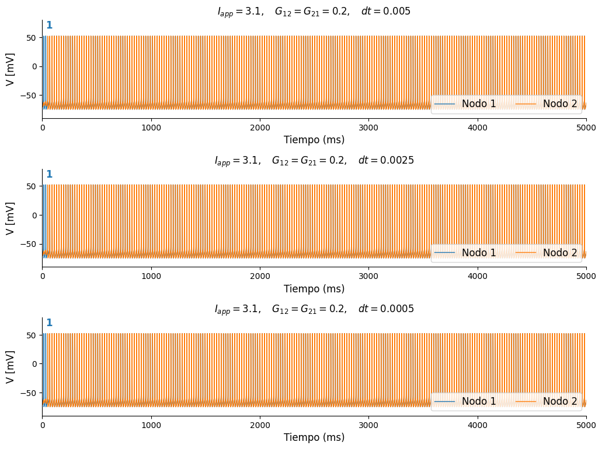
    

## Vario G21, con Iapp = 3.4

    trial 3 estado inicial: [-70, np.float64(0.07549760454331356), np.float64(0.03851552360485688), -65, np.float64(0.8060716092618073), np.float64(0.2618174467703125)]
    duración (segundos) de la simulación 55.194676876068115
    

    
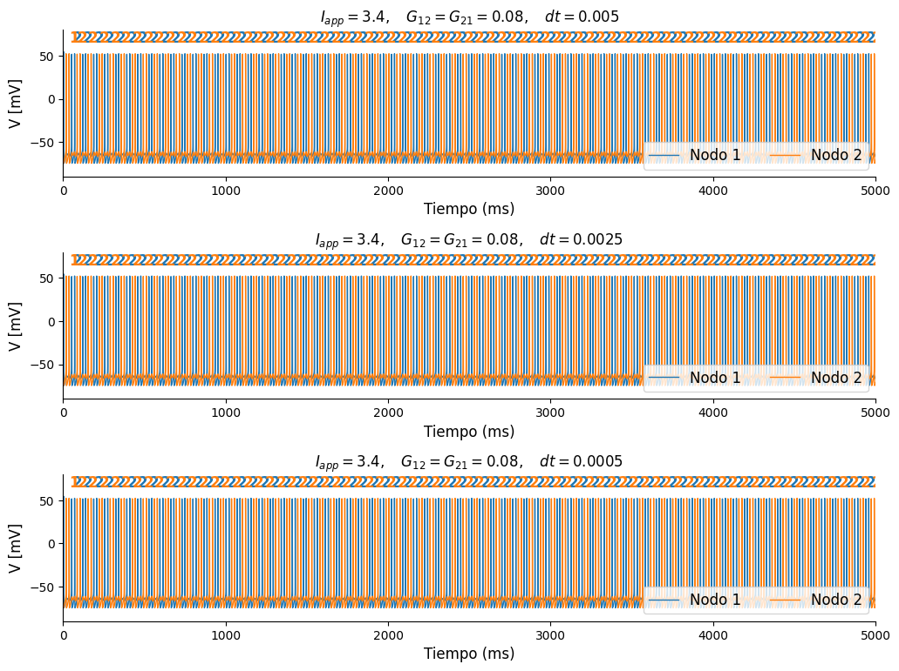
    

    trial 3 estado inicial: [-70, np.float64(0.7137334701689682), np.float64(0.7121223293539871), -65, np.float64(0.7346367953986238), np.float64(0.754268895223367)]
    duración (segundos) de la simulación 65.64381146430969
    corte por umbral!
    corte por umbral!
    corte por umbral!
    corte por umbral!
    corte por umbral!
    corte por umbral!
    

    
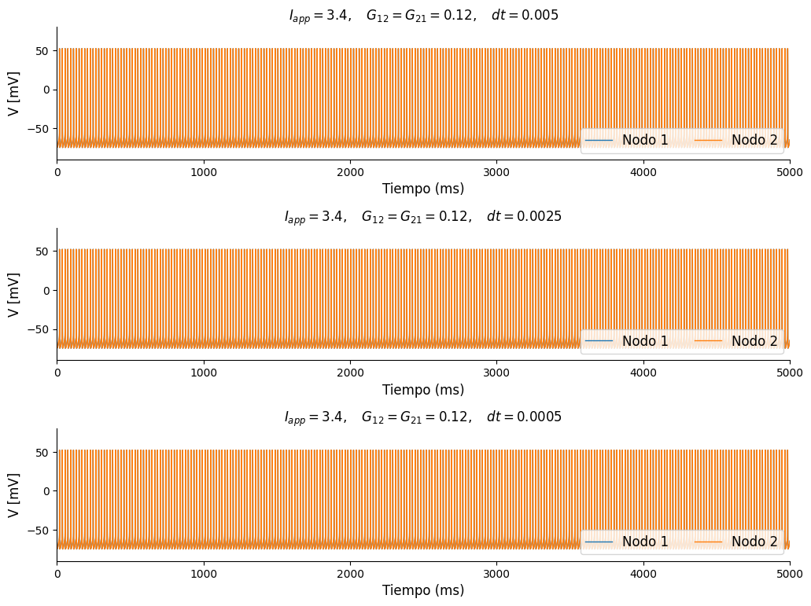
    

    trial 3 estado inicial: [-70, np.float64(0.9328614469832494), np.float64(0.3980591153933287), -65, np.float64(0.4283725660514316), np.float64(0.680125013059911)]
    duración (segundos) de la simulación 66.73110628128052
    

    
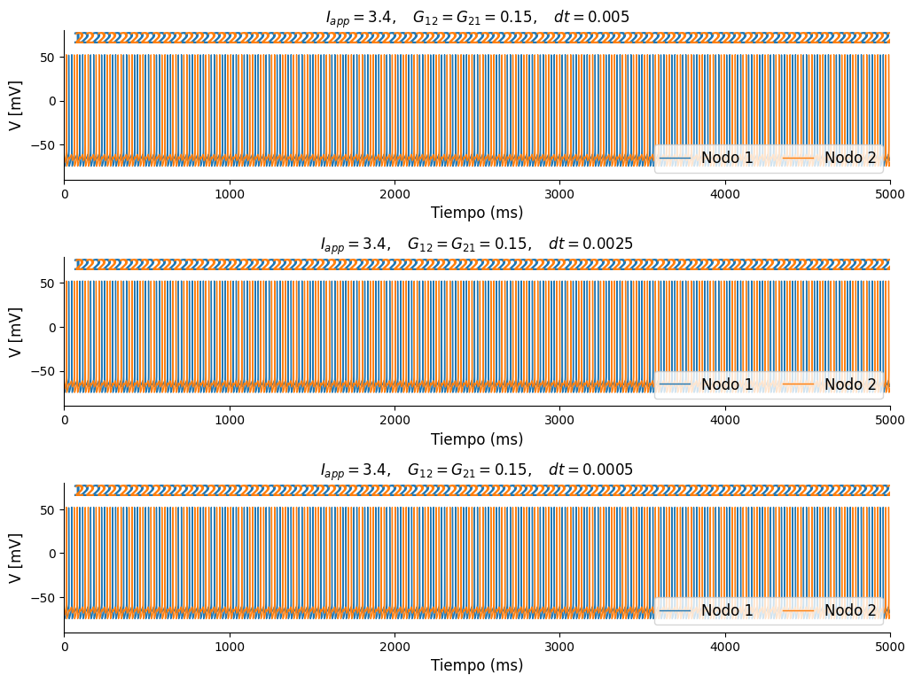
    

    trial 3 estado inicial: [-70, np.float64(0.18553564371966114), np.float64(0.9712793174417474), -65, np.float64(0.8137421750311185), np.float64(0.3805348472527934)]
    duración (segundos) de la simulación 60.11809253692627
    corte por umbral!
    corte por umbral!
    corte por umbral!
    corte por umbral!
    corte por umbral!
    corte por umbral!
    

    

    

    trial 3 estado inicial: [-70, np.float64(0.5360751951340008), np.float64(0.08882806428012402), -65, np.float64(0.10880716798268597), np.float64(0.2199686836795085)]
    duración (segundos) de la simulación 67.2961597442627
    corte por umbral!
    corte por umbral!
    corte por umbral!
    corte por umbral!
    corte por umbral!
    corte por umbral!
    

    
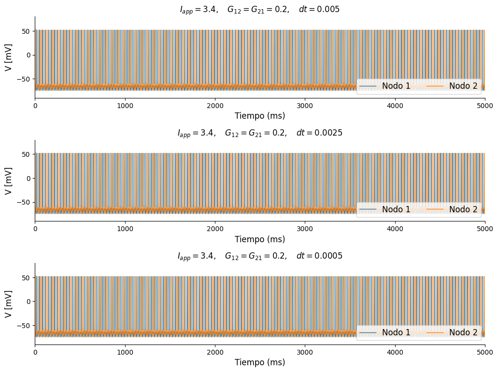
    

# Funciona por separado

    duración (segundos) de la simulación 3.5850374698638916
    ====================
    condiciones iniciales
    ====================
    trial 1 estado inicial: [-90, np.float64(0.2796175825175705), np.float64(0.48764543136574723), -65, np.float64(0.5349452382987099), np.float64(0.7490380656146792)]
    trial 2 estado inicial: [-80, np.float64(0.668637009359857), np.float64(0.0013739550400734268), -65, np.float64(0.6853116491982261), np.float64(0.7646448907444464)]
    trial 3 estado inicial: [-70, np.float64(0.2613193045981469), np.float64(0.9838398342556193), -65, np.float64(0.4484272252147491), np.float64(0.2804816491701765)]
    trial 4 estado inicial: [-50, np.float64(0.9138896857413431), np.float64(0.721583457441657), -65, np.float64(0.6515278606824486), np.float64(0.45487018290120396)]
    trial 5 estado inicial: [-40, np.float64(0.6851686512730157), np.float64(0.27616511318888093), -65, np.float64(0.32046612339111114), np.float64(0.24686157792889774)]
    trial 6 estado inicial: [-30, np.float64(0.36897282719625135), np.float64(0.693524843662258), -65, np.float64(0.9869101179419707), np.float64(0.21270983131589072)]
    trial 7 estado inicial: [10, np.float64(0.9854969924957055), np.float64(0.7179329732022951), -65, np.float64(0.4865808103611594), np.float64(0.014955980776830913)]
    

    
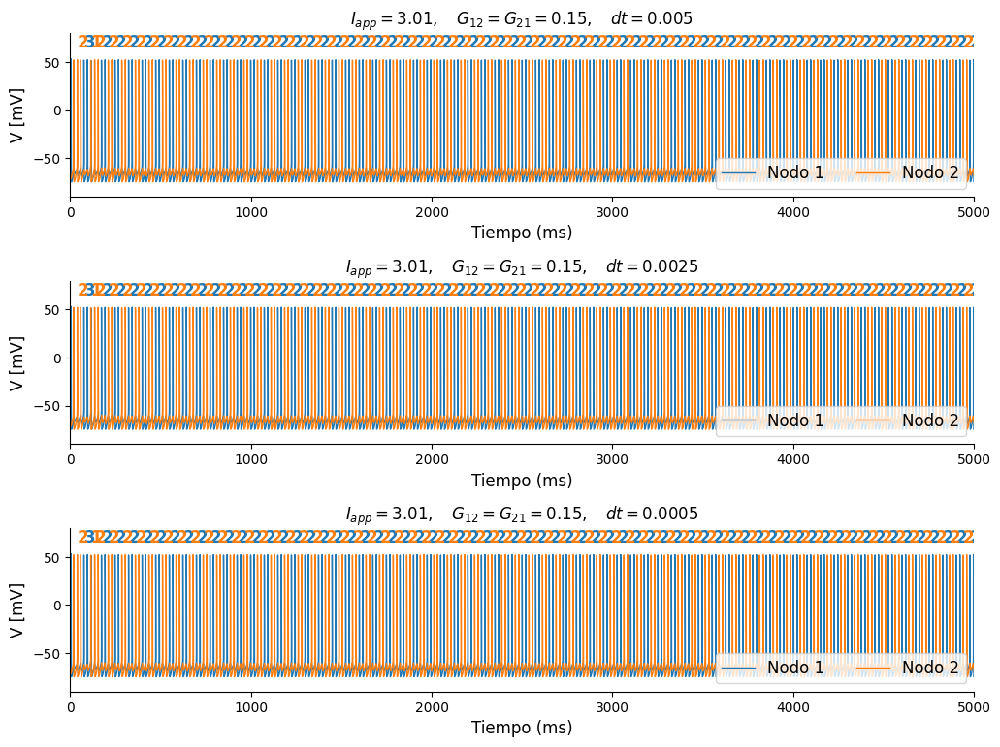
    

