# Simulaciones

## Iapp = 2.6

    condición incial: [10.    0.75  0.03 10.    0.8   0.26]
    duración (segundos): 39.5160858631134
    corte por umbral!
    corte por umbral!
    corte por umbral!
    corte por umbral!
    corte por umbral!
    corte por umbral!
    

    
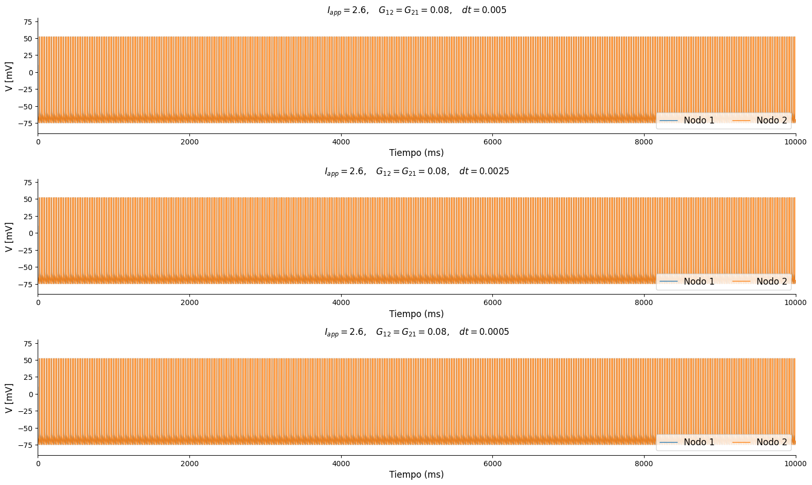
    

    condición incial: [-70.           0.39096358   0.92297703 -65.           0.38881872
       0.66796937]
    duración (segundos): 58.09686803817749
    corte por umbral!
    corte por umbral!
    corte por umbral!
    

    
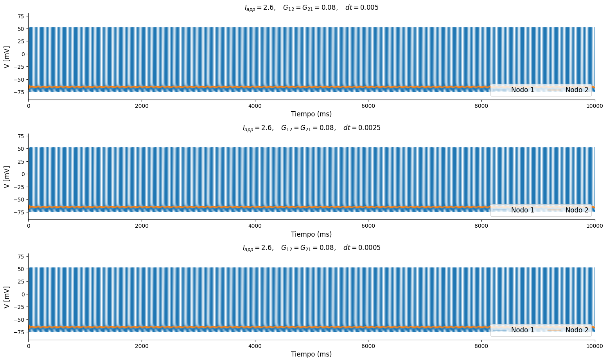
    

## Iapp = 3.1

    condición incial: [-7.0e+01  7.5e-01  3.0e-02 -6.5e+01  8.0e-01  2.6e-01]
    duración (segundos): 42.35308909416199
    corte por umbral!
    corte por umbral!
    corte por umbral!
    corte por umbral!
    corte por umbral!
    corte por umbral!
    

    
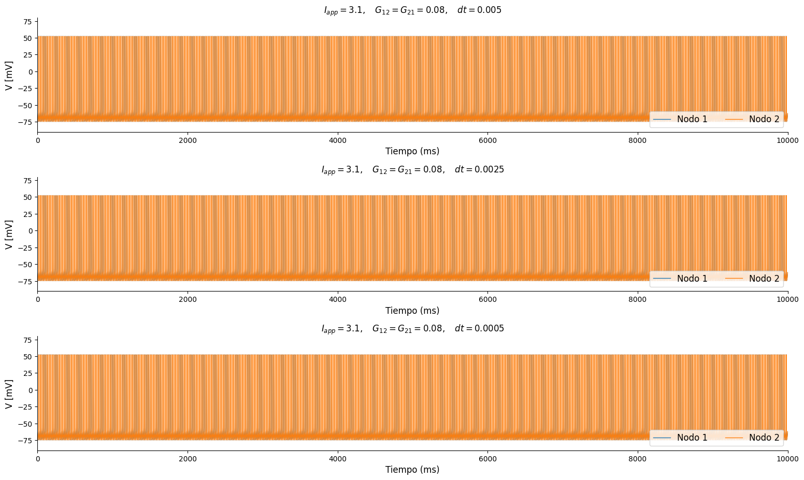
    

    condición incial: [-70.           0.92672583   0.19278154 -65.           0.42113741
       0.69340046]
    duración (segundos): 70.90206789970398
    corte por umbral!
    corte por umbral!
    corte por umbral!
    corte por umbral!
    corte por umbral!
    corte por umbral!
    

    
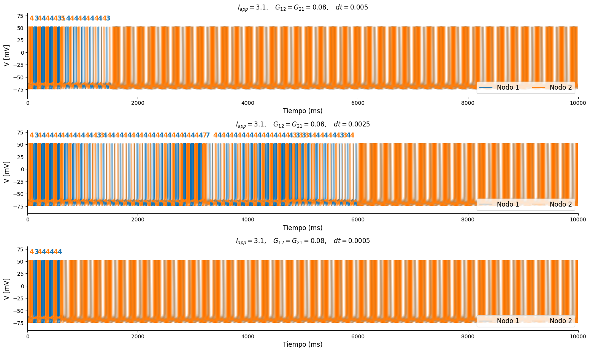
    

## Iapp = 3.2

    condición incial: [-70.           0.92672583   0.19278154 -65.           0.42113741
       0.69340046]
    duración (segundos): 49.81164836883545
    

    
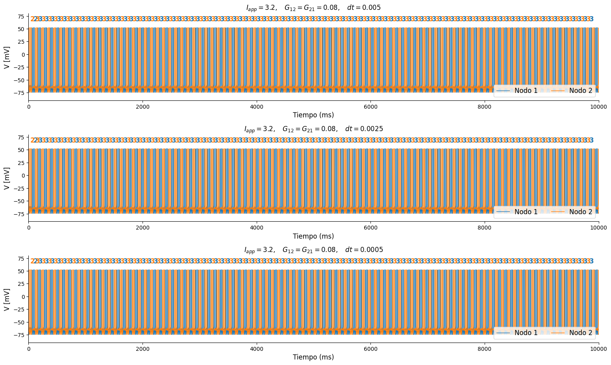
    

    condición incial: [-70.           0.92672583   0.19278154 -65.           0.42113741
       0.69340046]
    duración (segundos): 88.24423027038574
    corte por umbral!
    corte por umbral!
    corte por umbral!
    corte por umbral!
    corte por umbral!
    corte por umbral!
    

    
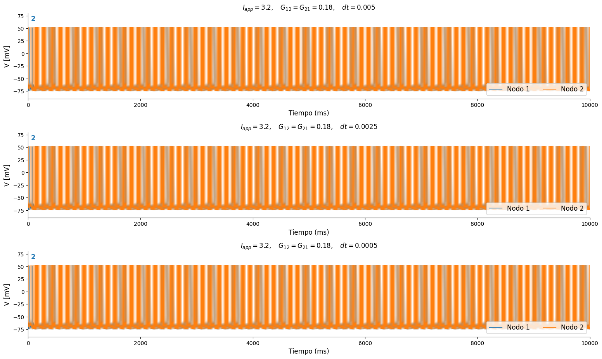
    

## Iapp = 3.3

    condición incial: [-7.00000000e+01  2.84228123e-03  2.55581223e-01 -6.50000000e+01
      8.72089000e-01  2.66851606e-01]
    duración (segundos): 48.17410445213318
    corte por umbral!
    corte por umbral!
    

    
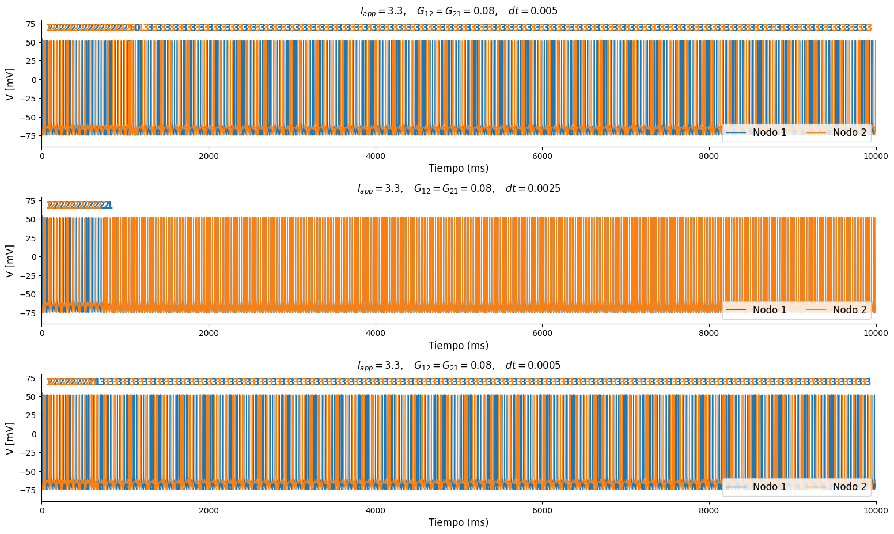
    

    condición incial: [-70.           0.92672583   0.19278154 -65.           0.42113741
       0.69340046]
    duración (segundos): 49.41620111465454
    corte por umbral!
    corte por umbral!
    corte por umbral!
    corte por umbral!
    corte por umbral!
    corte por umbral!
    

    
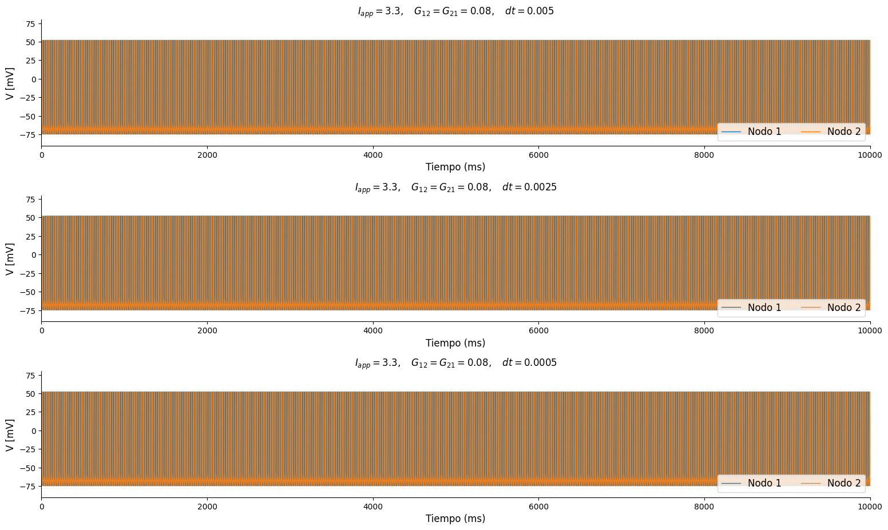
    

## Iapp = 3.4

    condición incial: [-7.00000000e+01  2.84228123e-03  2.55581223e-01 -6.50000000e+01
      8.72089000e-01  2.66851606e-01]
    duración (segundos): 50.86707544326782
    

    
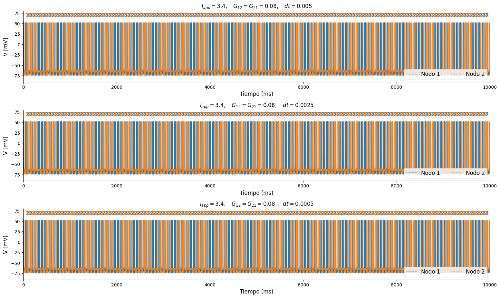
    

    condición incial: [-7.00000000e+01  2.84228123e-03  2.55581223e-01 -6.50000000e+01
      8.72089000e-01  2.66851606e-01]
    duración (segundos): 99.65949320793152
    

    
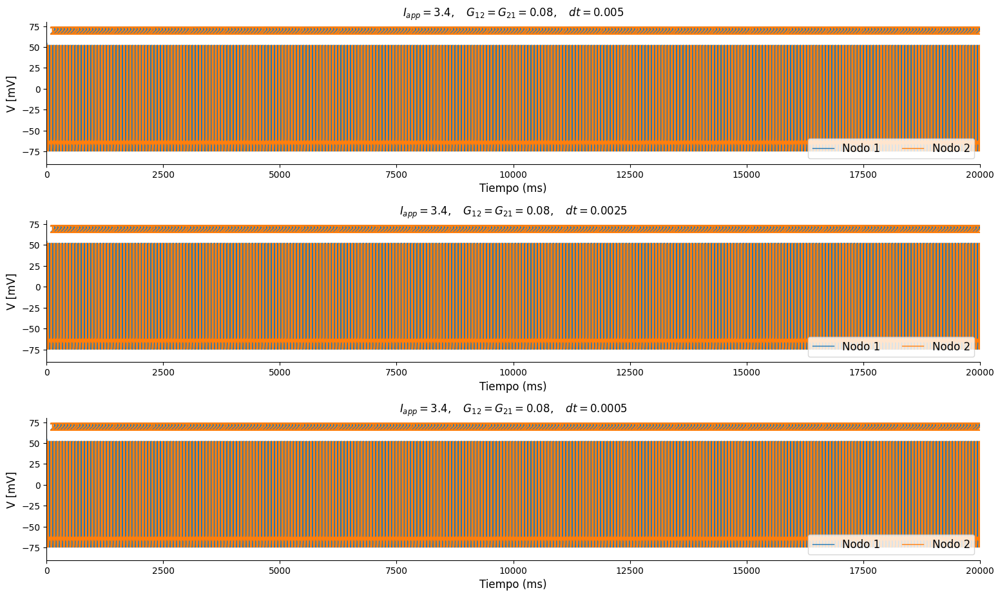
    

    condición incial: [-70.           0.5360752    0.08882806 -65.           0.10880717
       0.21996868]
    duración (segundos): 51.98760461807251
    corte por umbral!
    corte por umbral!
    corte por umbral!
    corte por umbral!
    corte por umbral!
    corte por umbral!
    

    
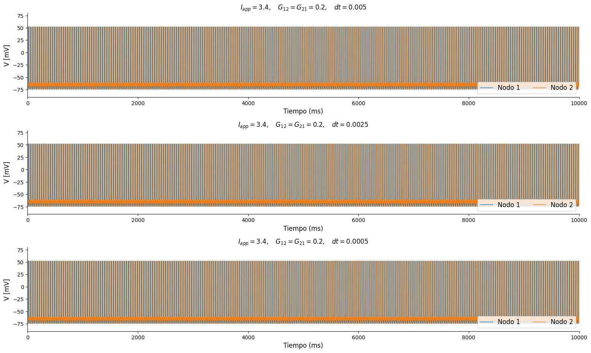
    

